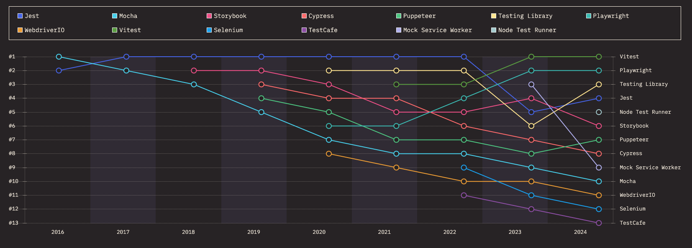

<p align="center"></p>

# Even testen (overzicht test libraries)

## ☕ Intro
Een compact overzicht van de verschillende Javascript test frameworks met hun doel + de voor- en nadelen. Tegenover de wens en vereisten.

## 🧪 Soorten tests
Kort overzicht van de verschillende soorten tests en waarvoor ze bedoeld zijn.

### Unit tests
Unit tests zijn kleine tests die een specifiek onderdeel van uw code testen, zoals een functie of methode. Ze zijn bedoeld om ervoor te zorgen dat elk onderdeel van uw code correct werkt.

### Integratie tests
Integratie tests testen hoe verschillende onderdelen van uw code samenwerken. Ze zijn bedoeld om ervoor te zorgen dat uw code als geheel correct werkt. 

### End-to-end tests
End-to-end tests testen de hele applicatie van begin tot eind. Ze zijn bedoeld om ervoor te zorgen dat de applicatie correct werkt in een realistische omgeving.

## 🚀 Populaire test libraries
> "*It's rare to see a trend as clear as Vitest's ascencion through the ranks over the past few years. While it may "only" be number four in terms of usage, it already tops the interest, retention, and overall positivity rankings – and shows no sign of conceding the top spot anytime soon.*" - State of JS

Een overzicht van de meest gebruikte testing libraries over tijd (gesorteerd op positiviteit):



[Bron: stateofjs 2024](https://2024.stateofjs.com/en-US/libraries/testing/)

### 🙈 Libraries niet meegenomen in de afweging:


-  **Storybook**: 
Buiten het feit dat Storybook een geweldige optie voor het ontwikkelen, visualiseren, documenteren en bijhouden van custom components, is het niet ontworpen voor het schrijven van E2E-tests die de volledige functionaliteit van een webapplicatie testen of unit-tests voor specifieke functies.


-  **Mock Service Worker**: Het doel van Mock Service Worker is het isoleren van de frontend tijdens het testen, zodat de tests niet afhankelijk zijn van een echte backend. Dit is heel handig (al helemaal als we gaan werken met externe bronnen als een API). MSW kan altijd later nog toegevoegd worden aan het project.

-  **Testing Library**:
Testing Library is geen test runner of vergelijkbaar met een ander testing framework. Testing Library is een bibliotheek die je helpt om betere UI-tests te schrijven, vanuit het perspectief van de gebruiker door het kunnen renderen van een DOM en custom components. Erg handig maar kan altijd later geïmplementeerd worden.

-  **Node Test Runner**: Node Test Runner is een test runner gebouwd in Node.js zelf. Dus geen browserinteractie mogelijk, wat wel een vereiste is.


### Overzicht van libraries:
```text
✅ = Functie bestaat (mogelijk in beperkte vorm)

🚧 = Functie is mogelijk aanwezig, maar niet praktisch of officieel uitgebracht

❌ = Functie bestaat (nog) niet
```
| **Library** | [Jest](https://github.com/facebook/jest) | [Mocha](https://github.com/mochajs/mocha) | [Cypress](https://github.com/cypress-io/cypress) | [Puppeteer](https://github.com/puppeteer/puppeteer) | [Playwright](https://github.com/microsoft/playwright) | [WebdriverIO](https://github.com/webdriverio/webdriverio) | [Vitest](https://github.com/vitest-dev/vitest) | [Selenium](https://github.com/SeleniumHQ/selenium) | [TestCafe](https://github.com/DevExpress/testcafe)
|---|---|---|---|---|---|---|---|---|---|
| **Logo** | <center></center> | <center></center> | <center></center> | <center></center> | <center></center> | <center></center> | <center></center> | <center></center> | <center></center> |
| Github stars |  |  |  |  |  |  |  |  |  |
| Contributors |  |  |  |  |  |  |  |  |  |
| Last Commit |  |  |  |  |  |  |  |  |  |
| License |  |  |  |  |  |  |  |  |  |
| Unit tests | ✅ | ✅ | 🚧 | ❌ | 🚧 | 🚧 | ✅ | ❌ | ❌ |
| Integratietests | ✅ | ✅ | ✅ | ✅ | ✅ | ✅ | ✅ | ✅ | ✅ |
| End-to-end tests | ❌ | ❌ | ✅ | ✅ | ✅ | ✅ | ❌ | ✅ | ✅ |
| Screenshots | ❌ | ❌ | ✅  | ✅  | ✅  | ❌ | ❌ | ❌ | ✅  |
| Typescript ondersteuning | ✅  | ❌ | ✅  | ✅  | ✅  | ✅  | ✅  | ❌ | ✅  |
| Kosten | Gratis 💸 | Gratis 💸 | Gratis 💸 | Gratis 💸 | Gratis 💸 | Gratis 💸 | Gratis 💸 | Gratis 💸 | Gratis 💸 |
| Ondersteuning meerdere browsers | 🚧, alleen via mocking | ❌ | 🚧, alleen Chromium gebaseerd | ✅ , Chromium, Firefox, WebKit | ✅ , Chromium, Firefox, WebKit | ✅ , Chromium, Firefox, WebKit | 🚧, alleen via mocking | ✅ , Chromium, Firefox, WebKit | ✅ , Chromium, Firefox, WebKit |